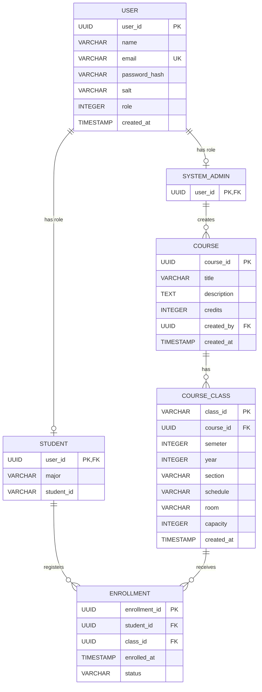

# ERD

```mermaid
erDiagram
    USER ||--o| SYSTEM_ADMIN : "has role"
    USER ||--o| STUDENT : "has role"

    SYSTEM_ADMIN ||--o{ COURSE : creates
    COURSE ||--o{ COURSE_CLASS : has

    STUDENT ||--o{ ENROLLMENT : registers
    COURSE_CLASS ||--o{ ENROLLMENT : receives

    USER {
        UUID user_id PK
        VARCHAR name
        VARCHAR email UK
        VARCHAR password_hash
        VARCHAR salt
        INTEGER role
        TIMESTAMP created_at
    }

    SYSTEM_ADMIN {
        UUID user_id PK, FK
    }

    STUDENT {
        UUID user_id PK, FK
        VARCHAR major
        VARCHAR student_id
    }

    COURSE {
        UUID course_id PK
        VARCHAR title
        TEXT description
        INTEGER credits
        UUID created_by FK
        TIMESTAMP created_at
    }

    COURSE_CLASS {
        VARCHAR class_id PK
        UUID course_id FK
        INTEGER semeter
        INTEGER year
        VARCHAR section
        VARCHAR schedule
        VARCHAR room
        INTEGER capacity
        TIMESTAMP created_at
    }

    ENROLLMENT {
        UUID enrollment_id PK
        UUID student_id FK
        UUID class_id FK
        TIMESTAMP enrolled_at
        VARCHAR status
    }
```