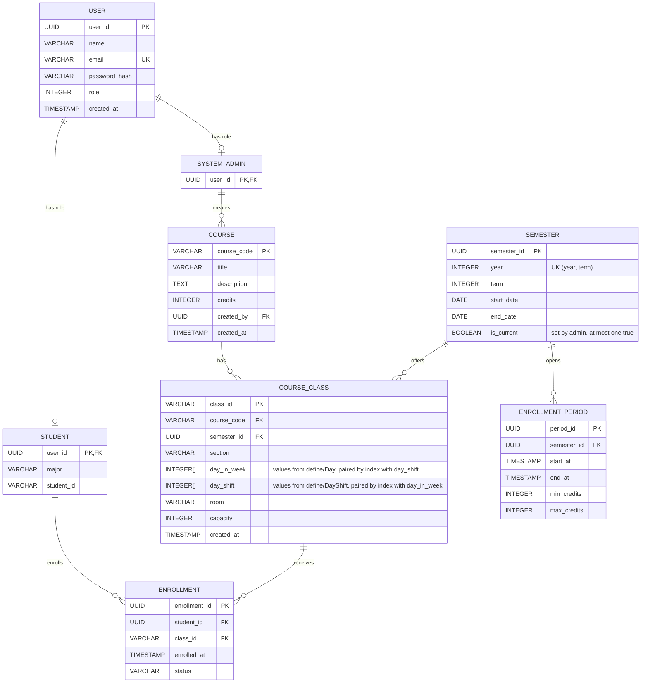

# ERD

```mermaid
erDiagram
    USER ||--o| SYSTEM_ADMIN : "has role"
    USER ||--o| STUDENT : "has role"

    SYSTEM_ADMIN ||--o{ COURSE : creates
    COURSE ||--o{ COURSE_CLASS : has

    SEMESTER ||--o{ COURSE_CLASS : offers
    SEMESTER ||--o{ ENROLLMENT_PERIOD : opens

    STUDENT ||--o{ ENROLLMENT : enrolls
    COURSE_CLASS ||--o{ ENROLLMENT : receives

    USER {
        UUID user_id PK
        VARCHAR name
        VARCHAR email UK
        VARCHAR password_hash
        INTEGER role
        TIMESTAMP created_at
    }

    SYSTEM_ADMIN {
        UUID user_id PK, FK
    }

    STUDENT {
        UUID user_id PK, FK
        VARCHAR major
        VARCHAR student_id
    }

    COURSE {
        VARCHAR course_code PK
        VARCHAR title
        TEXT description
        INTEGER credits
        UUID created_by FK
        TIMESTAMP created_at
    }

    COURSE_CLASS {
        VARCHAR class_id PK
        VARCHAR course_code FK
        UUID semester_id FK
        VARCHAR section
        INTEGER[] day_in_week "values from define/Day, paired by index with day_shift"
        INTEGER[] day_shift "values from define/DayShift, paired by index with day_in_week"
        VARCHAR room
        INTEGER capacity
        TIMESTAMP created_at
    }

    SEMESTER {
        UUID semester_id PK
        INTEGER year "UK (year, term)"
        INTEGER term
        DATE start_date
        DATE end_date
        BOOLEAN is_current "set by admin, at most one true"
    }

    ENROLLMENT_PERIOD {
        UUID period_id PK
        UUID semester_id FK
        TIMESTAMP start_at
        TIMESTAMP end_at
        INTEGER min_credits
        INTEGER max_credits
    }

    ENROLLMENT {
        UUID enrollment_id PK
        UUID student_id FK
        VARCHAR class_id FK
        TIMESTAMP enrolled_at
        VARCHAR status
    }
```